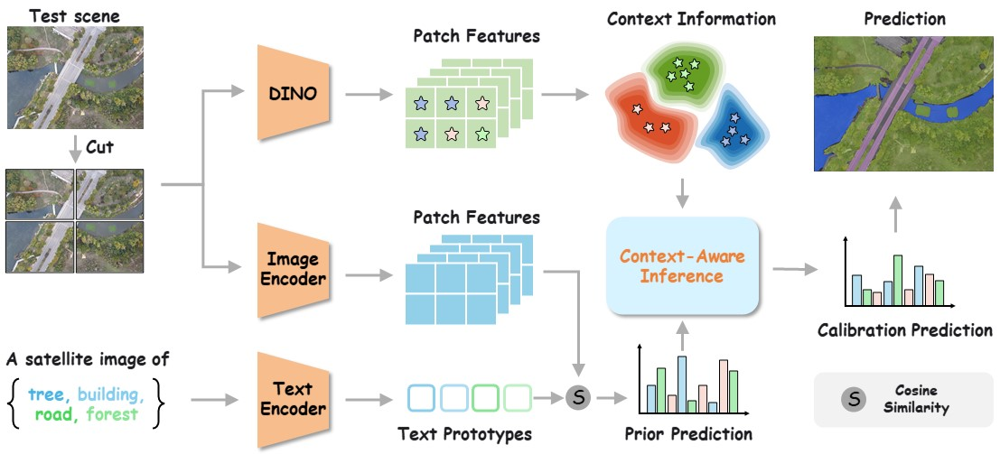

<div align="center">

<h1>ConInfer: Context-Aware Inference for Training-Free Open-Vocabulary Remote Sensing Segmentation</h1>



</div>

## Abstract
> Training-free open-vocabulary remote sensing segmentation (OVRSS), empowered by vision-language models, has emerged as a promising paradigm for achieving category-agnostic semantic understanding in remote sensing imagery. Existing approaches mainly focus on enhancing feature representations or mitigating modality discrepancies to improve patch-level prediction accuracy. However, such independent prediction schemes are fundamentally misaligned with the intrinsic characteristics of remote sensing data. In real-world applications, remote sensing scenes are typically large-scale and exhibit strong spatial as well as semantic correlations, making isolated patch-wise predictions insufficient for accurate segmentation. To address this limitation, we propose \textbf{ConInfer}, a context-aware inference framework for OVRSS that performs joint prediction across multiple spatial units while explicitly modeling their inter-unit semantic dependencies. By incorporating global contextual cues, our method significantly enhances segmentation consistency, robustness, and generalization in complex remote sensing environments. Extensive experiments on multiple benchmark datasets demonstrate that our approach consistently surpasses state-of-the-art per-pixel VLM-based baselines such as SegEarth-OV, achieving average improvements of 2.80\% and 6.13\% on open-vocabulary semantic segmentation and object extraction tasks, respectively. All source codes will be publicly released upon the paper’s acceptance. 

## Dependencies and Installation


```
# 1. create new anaconda env
conda create -n ConInfer python=3.11
conda activate ConInfer

# 2.install torch and dependencies
pip install -r requirements.txt
# The dependent versions are not strict, and in general you only need to pay attention to mmcv and mmsegmentation.
```


## Datasets
We include the following dataset configurations in this repo: 
1) `Semantic Segmentation`: OpenEarthMap, LoveDA, iSAID, Potsdam, Vaihingen, UAVid<sup>img</sup>, UDD5, VDD
2) `Building Extraction`: WHU<sup>Aerial</sup>, WHU<sup>Sat.Ⅱ</sup>, Inria, xBD<sup>pre</sup>
4) `Road Extraction`: CHN6-CUG, DeepGlobe, Massachusetts, SpaceNet
5) `Water Extraction`: WBS-SI

Please refer to [dataset_prepare.md](https://github.com/likyoo/SegEarth-OV/blob/main/dataset_prepare.md) for dataset preparation.


## Model evaluation
Multi-GPU:
```
bash ./dist_test.sh ./config/cfg_DATASET.py
```

Results will be saved in `results.xlsx`.

## Acknowledgement
This implementation is based on [SegEarth](https://github.com/likyoo/SegEarth-OV) and [DINOV3](https://github.com/facebookresearch/dinov3). Thanks for the awesome work.

